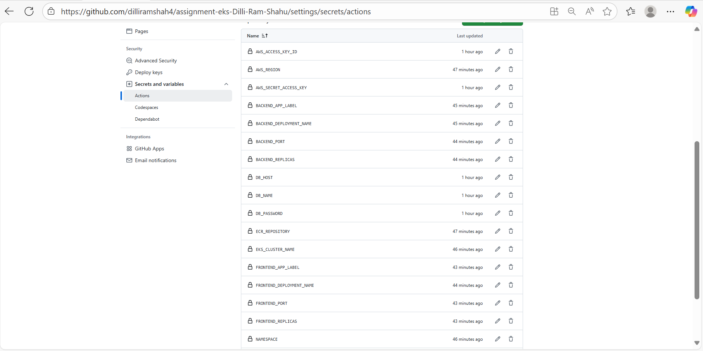
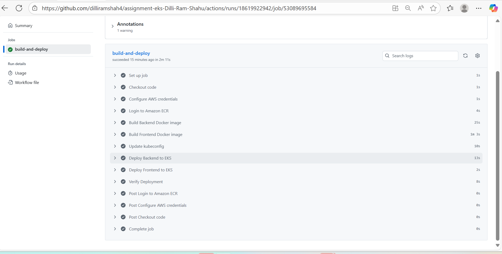

# CI/CD Pipeline Documentation

## Overview
Automated CI/CD pipeline using GitHub Actions for building and deploying containerized applications to Amazon EKS cluster.

## Pipeline Triggers
- Push to main branch (only when files in backend/, frontend/, or k8s/ directories change)
- Pull requests to main branch
- Manual workflow dispatch

## Pipeline Workflow

### Build Phase
1. Checkout source code from repository
2. Configure AWS credentials using GitHub secrets
3. Login to Amazon ECR registry
4. Build Docker images conditionally:
   - Backend image built when backend files change
   - Frontend image built when frontend files change with API URL build argument
5. Push images to ECR with commit SHA tags

### Deploy Phase
1. Update kubeconfig for EKS cluster access
2. Generate deployment manifests dynamically using secrets
3. Deploy backend application to Kubernetes namespace
4. Deploy frontend application to Kubernetes namespace
5. Verify deployment rollout status

## Required GitHub Secrets

### AWS Configuration
- AWS_ACCESS_KEY_ID: AWS access key for ECR and EKS access
- AWS_SECRET_ACCESS_KEY: AWS secret access key
- AWS_REGION: AWS region for resources
- ECR_REPOSITORY: ECR repository name for Docker images
- EKS_CLUSTER_NAME: EKS cluster name for deployment

### Application Configuration
- NAMESPACE: Kubernetes namespace for deployments
- BACKEND_DEPLOYMENT_NAME: Backend deployment name
- BACKEND_APP_LABEL: Backend application label
- BACKEND_PORT: Backend application port
- BACKEND_REPLICAS: Number of backend replicas
- FRONTEND_DEPLOYMENT_NAME: Frontend deployment name
- FRONTEND_APP_LABEL: Frontend application label
- FRONTEND_PORT: Frontend application port
- FRONTEND_REPLICAS: Number of frontend replicas

### Database Configuration
- DB_HOST: Database host address
- DB_USER: Database username
- DB_PASSWORD: Database password
- DB_NAME: Database name

### Frontend Configuration
- REACT_APP_API_URL: Backend API URL for frontend application

## Image Tagging Strategy
- Backend images: ECR_REPOSITORY:backend-COMMIT_SHA
- Frontend images: ECR_REPOSITORY:frontend-COMMIT_SHA

## Deployment Strategy
- Rolling updates for zero-downtime deployments
- Conditional deployment based on file changes
- Prometheus monitoring annotations for backend pods
- Environment variables injected from GitHub secrets

## Pipeline Features
- Conditional builds to optimize build time
- Secure credential management using GitHub secrets
- Dynamic manifest generation
- Deployment verification and status reporting
- Support for manual pipeline execution

## Monitoring and Verification
- Deployment rollout status monitoring
- Pod status verification
- Service endpoint reporting
- 300-second timeout for deployment completion

This pipeline ensures consistent, secure, and automated deployments while maintaining traceability through commit-based image tagging.
