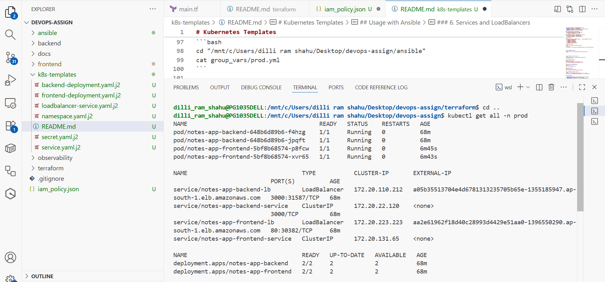
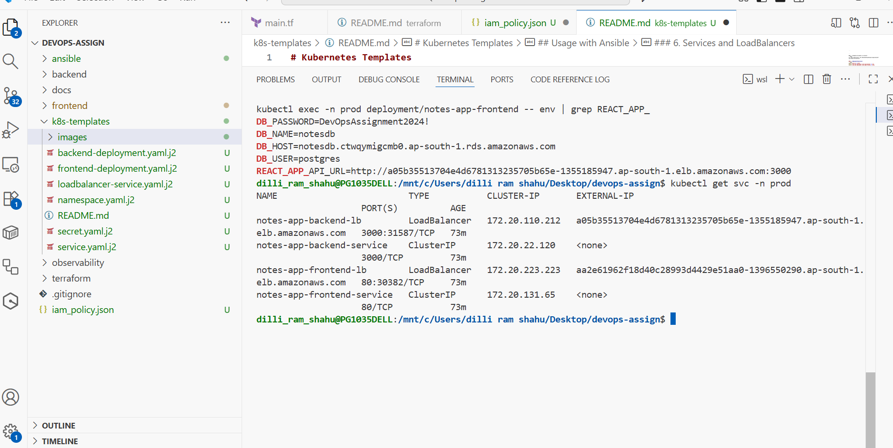
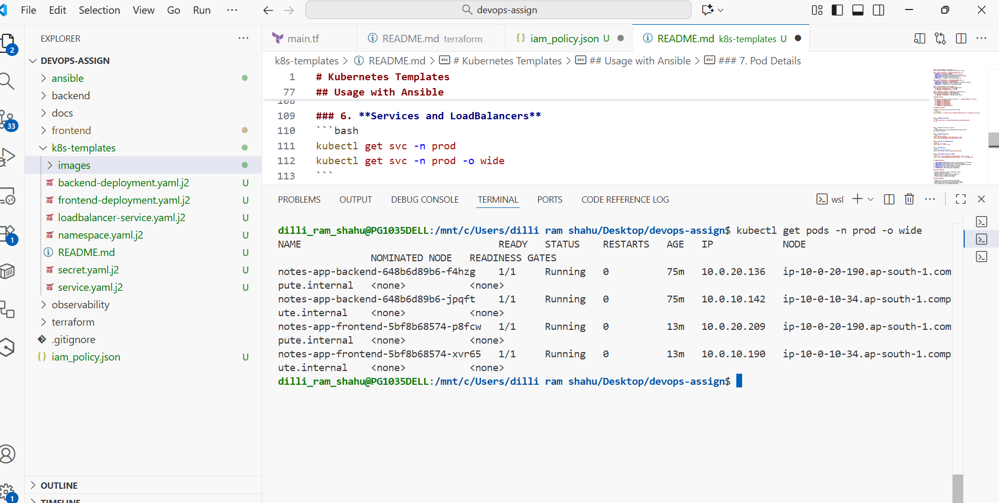

# Kubernetes Templates

This directory contains Jinja2 templates for deploying the full-stack notes application to Kubernetes. These templates are processed by Ansible to generate environment-specific manifests.

## Template Files

```
k8s-templates/
├── README.md                        # This file
├── namespace.yaml.j2                # Kubernetes namespace
├── secret.yaml.j2                   # Database credentials secret
├── backend-deployment.yaml.j2       # Backend API deployment
├── frontend-deployment.yaml.j2      # Frontend React app deployment
├── service.yaml.j2                  # ClusterIP services
├── loadbalancer-service.yaml.j2     # LoadBalancer services for external access

```

## Deployed Resources 

### All Kubernetes Resources in Production Namespace
```bash
kubectl get all -n prod
```


### Services in Production Namespace
```bash
kubectl get svc -n prod
```


### Services with Wide Output (Detailed View)
```bash
kubectl get svc -n prod -o wide
```


## Template Variables

### Global Variables
- `namespace`: Kubernetes namespace (prod/staging)
- `app_name`: Application name prefix
- `replicas`: Number of pod replicas
- `ecr_uri`: ECR repository base URI

### Backend Variables
- `db_host`: PostgreSQL RDS endpoint
- `db_user`: Database username
- `db_password`: Database password (from secrets)
- `db_name`: Database name

### Frontend Variables
- `frontend_tag`: Frontend Docker image tag
- `backend_url`: Backend LoadBalancer URL for API calls

## Template Features

### 1. Namespace Template (`namespace.yaml.j2`)
Creates isolated environment for application resources.

### 2. Secret Template (`secret.yaml.j2`)
Stores sensitive database credentials as Kubernetes secrets.

### 3. Backend Deployment (`backend-deployment.yaml.j2`)
- **Image**: `{{ ecr_uri }}:backend`
- **Environment Variables**: Database connection details
- **Health Checks**: Liveness and readiness probes on `/health`
- **Resources**: CPU/memory requests and limits
- **Replicas**: {{ replicas }} for high availability

### 4. Frontend Deployment (`frontend-deployment.yaml.j2`)
- **Image**: `{{ ecr_uri }}:{{ frontend_tag }}`
- **Environment Variables**: `REACT_APP_API_URL` for backend connection
- **Resources**: Optimized for static content serving
- **Replicas**: {{ replicas }} for load distribution

### 5. Service Template (`service.yaml.j2`)
Creates ClusterIP services for internal communication:
- `{{ app_name }}-backend-service`: Port 3000
- `{{ app_name }}-frontend-service`: Port 80

### 6. LoadBalancer Template (`loadbalancer-service.yaml.j2`)
Exposes services externally via AWS LoadBalancer:
- `{{ app_name }}-backend-lb`: External API access
- `{{ app_name }}-frontend-lb`: Web application access

## Usage with Ansible

Templates are automatically processed when running:
```bash
cd ../ansible
ansible-playbook -i inventory/hosts playbooks/deploy-kubectl.yml -e @group_vars/prod.yml
```

## Template Benefits

1. **Environment Separation**: Different configurations for prod/staging
2. **Reusability**: Same templates work across environments
3. **Maintainability**: Single source of truth for Kubernetes manifests
4. **Security**: Sensitive data handled via secrets
5. **Scalability**: Easy replica count adjustment
6. **Flexibility**: Variable-driven configuration
