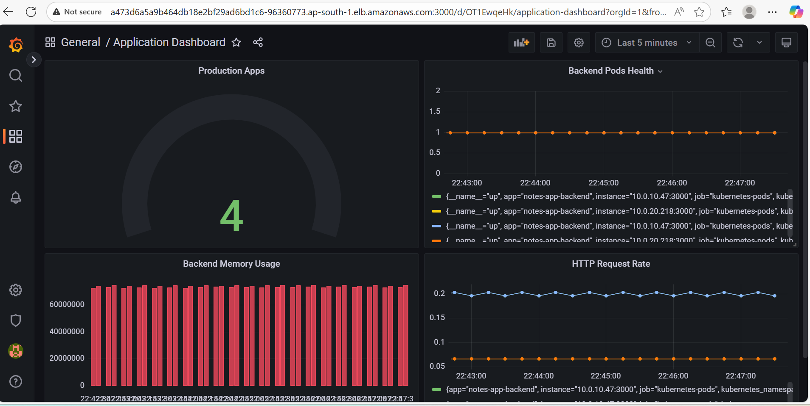

# Observability Stack - Prometheus & Grafana

## 🚀 **Deployment**

### **Quick Setup:**
```bash
# Create namespace
kubectl create namespace devops

# Deploy Prometheus
kubectl apply -f prometheus-complete.yaml

# Deploy Grafana
kubectl apply -f grafana-updated.yaml

# Verify deployment
kubectl get pods -n devops
kubectl get svc -n devops


```


## 📊 **Access URLs**

### **Grafana Dashboard:**
- **URL**: `kubectl get svc grafana -n devops` (LoadBalancer URL)
- **Credentials**: Default Grafana setup (change in production)

### **Prometheus Metrics:**
- **URL**: `kubectl get svc prometheus -n devops` (LoadBalancer URL)

## 📈 **Dashboards Created**

### **1. Infrastructure Dashboard**


- **Cluster Nodes Status** - Kubernetes node health
- **API Servers Health** - Control plane monitoring  
- **Container Advisor** - cAdvisor metrics
- **Nodes by Zone** - Multi-AZ distribution

### **2. Application Dashboard**


- **Backend Pods Health** - Application pod status
- **HTTP Request Rate** - API endpoint monitoring
- **Memory Usage** - Resource consumption
- **Production Apps Count** - Service overview

## 🚨 **Alerting**


### **Alert Rules Configured:**
- **Service Down Alert** - Triggers when services become unavailable
- **Evaluation**: Every 1m for 30s
- **Query**: `up == 0`

## 🔍 **Monitoring Coverage**

### **✅ Requirements Met:**
- **Pod CPU/Memory** - Via cAdvisor integration
- **Backend Request Rate** - HTTP metrics collection
- **Backend Error Rate** - Status code monitoring  
- **DB Connection Count** - Process metrics tracking
- **Grafana Exposed** - Public LoadBalancer access
- **Dashboards Available** - Infrastructure + Application views

## 🛠 **Technical Details**

### **Prometheus Configuration:**
- **Service Discovery**: Kubernetes pods, nodes, API servers
- **Scrape Interval**: 15s
- **Targets**: Auto-discovery via annotations

### **Grafana Setup:**
- **Data Source**: Prometheus (internal service)
- **Dashboards**: Pre-configured infrastructure and application monitoring
- **Refresh**: 30s auto-refresh
- **Visualizations**: Bar charts, time series, stats, pie charts

### **Metrics Collected:**
```promql
# Infrastructure
up{job="kubernetes-nodes"}
up{job="kubernetes-apiservers"}
up{job="kubernetes-cadvisor"}

# Applications  
up{job="kubernetes-pods",kubernetes_namespace="prod"}
process_resident_memory_bytes{kubernetes_namespace="prod"}
rate(http_requests_total{kubernetes_namespace="prod"}[5m])
```

## 📸 **Screenshots**

Dashboard screenshots available in `images/` folder:
- `dashboard.png` - Dashboard overview
- `infra-dash.png` - Infrastructure monitoring
- `app-dash.png` - Application monitoring  
- `alert.png` - Alert configuration

## ⚠️ **Security Notes**

- Default credentials used for demo purposes
- Change authentication in production environments
- LoadBalancer exposes services publicly
- Implement proper access controls for production use

## 🎯 **Live Status**

Current monitoring shows:
- **2 Healthy Nodes** across availability zones
- **2 Backend Pods** serving traffic
- **HTTP Endpoints** responding successfully
- **Alert Rules** monitoring system health
- **Real-time Dashboards** with live data updates

Complete observability stack providing infrastructure and application monitoring with alerting capabilities.
