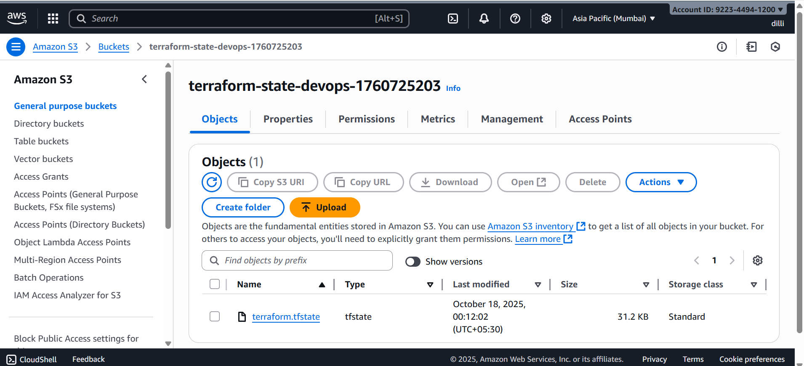
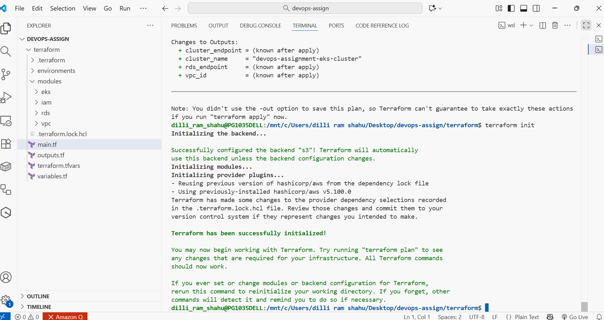
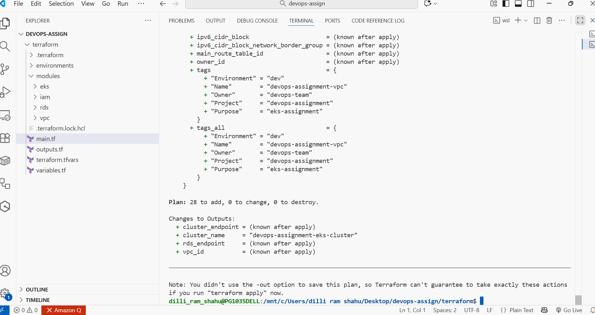
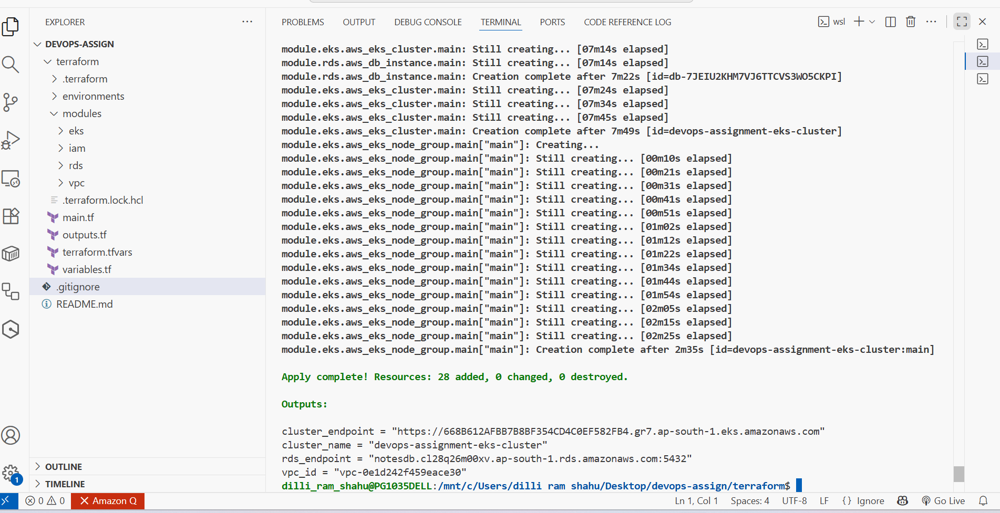

# DevOps Assignment - Terraform Infrastructure

This project contains Terraform configuration for deploying AWS infrastructure including VPC, EKS cluster, and RDS database with S3 backend for state management.

## Architecture

- **VPC**: Custom VPC with public and private subnets
- **EKS**: Kubernetes cluster with managed node groups
- **RDS**: PostgreSQL database in private subnets
- **S3 Backend**: Remote state storage with DynamoDB locking

## Prerequisites

- AWS CLI configured
- Terraform >= 1.0
- AWS Account with appropriate permissions

## Backend Configuration

The project uses S3 backend for remote state management:
- **S3 Bucket**: `${var.s3_bucket_name}`
- **DynamoDB Table**: `${var.dynamodb_table_name}`
- **Region**: `${var.aws_region}`



## Deployment Steps

### 1. Initialize Terraform

```bash
cd terraform
terraform init
```



### 2. Plan Infrastructure

```bash
terraform plan
```



### 3. Apply Configuration

```bash
terraform apply
```



## Configuration Files

- `main.tf` - Main Terraform configuration with backend
- `variables.tf` - Variable definitions
- `terraform.tfvars` - Variable values
- `outputs.tf` - Output definitions
- `modules/` - Reusable modules for VPC, EKS, and RDS

## Variables

Key variables in `terraform.tfvars`:
- `aws_region` - AWS region
- `cluster_name` - EKS cluster name
- `vpc_cidr` - VPC CIDR block
- `availability_zones` - AZs for deployment
- `db_password` - RDS database password

## Modules

### VPC Module
- Creates VPC with public/private subnets
- Internet Gateway and NAT Gateway
- Route tables and security groups

### EKS Module
- EKS cluster with managed node groups
- IAM roles and policies
- Security groups for cluster communication

### RDS Module
- PostgreSQL database instance
- Subnet group for database
- Security groups for database access

## Cleanup

To destroy the infrastructure:

```bash
terraform destroy
```

## Notes

- State is stored remotely in S3 with DynamoDB locking
- All resources are tagged for identification
- Database password is marked as sensitive
- Infrastructure follows AWS best practices
